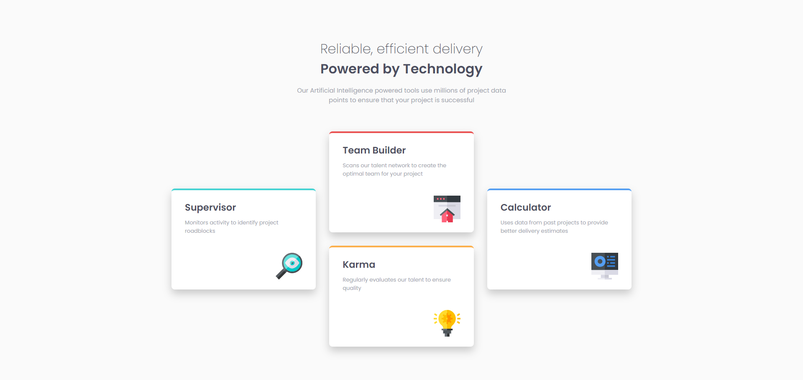
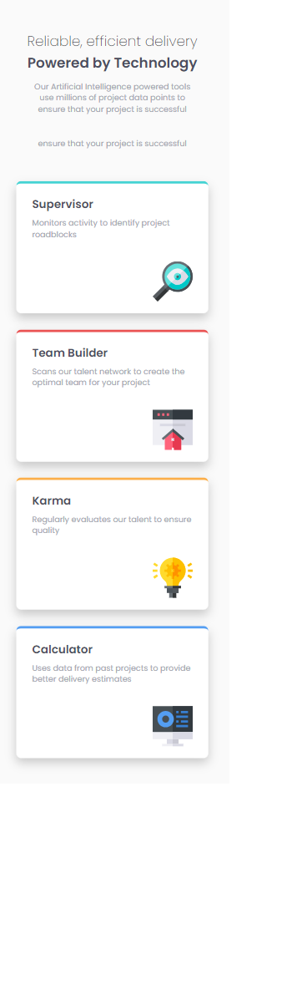

# Frontend Mentor - Four card feature section solution

This is a solution to the [Four card feature section challenge on Frontend Mentor](https://www.frontendmentor.io/challenges/four-card-feature-section-weK1eFYK). Frontend Mentor challenges help you improve your coding skills by building realistic projects. 

## Table of contents

- [Overview](#overview)
  - [The challenge](#the-challenge)
  - [Screenshot](#screenshot)
  - [Links](#links)
- [My process](#my-process)
  - [Built with](#built-with)
  - [What I learned](#what-i-learned)
  - [Continued development](#continued-development)
  - [Useful resources](#useful-resources)
- [Author](#author)

## Overview
Hello everone 👋🏻 This is my solution to  Four card feature section challenge from front-end mentor. Hope you enjoy it.

### The challenge

Users should be able to:

- View the optimal layout for the site depending on their device's screen size

### Screenshot

### Links

- Solution URL: [solution URL](https://github.com/HosseinHeydarpour/Four-card-feature-section)
- Live Site URL: [Live site URL](https://hosseinheydarpour.github.io/Four-card-feature-section/)

## My process
I leveraged CSS grid to create a responsive layout for the page and the cards. I also used flex-box to align the content within each card. For this challenge, I adopted SASS and BEM to write modular and maintainable code

### Built with

- Semantic HTML5 markup
- CSS custom properties
- Flexbox
- CSS Grid
- Desktop-first workflow

### What I learned

Positioning the cards was the most challenging part of this challenge, which helped me improve my CSS grid skills even more!

To see how you can add code snippets, see below:

### Continued development

 I really look forward to tackling challenges that require JS. 

## Author
- Frontend Mentor - [@HosseinHeydarpour](https://www.frontendmentor.io/profile/HosseinHeydarpour)
- Linkedin - [@hosseinheydarpour](www.linkedin.com/in/hosseinheydarpour)

